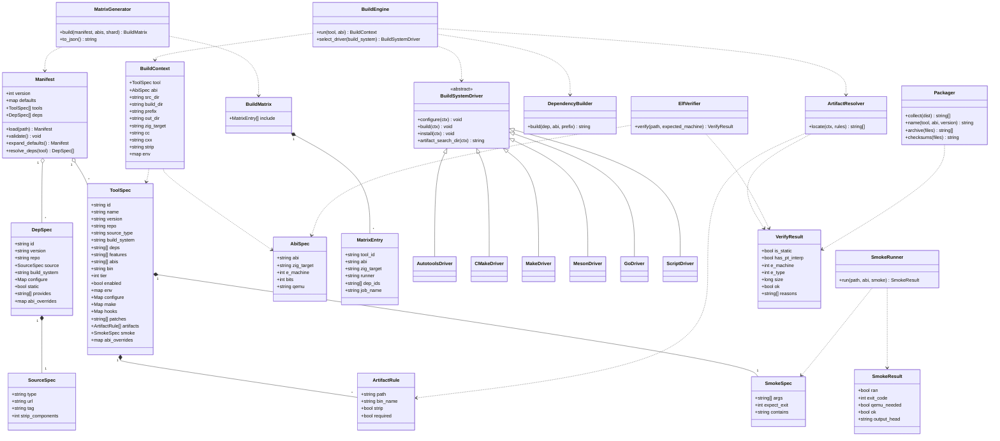
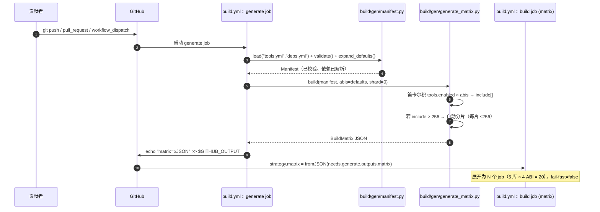
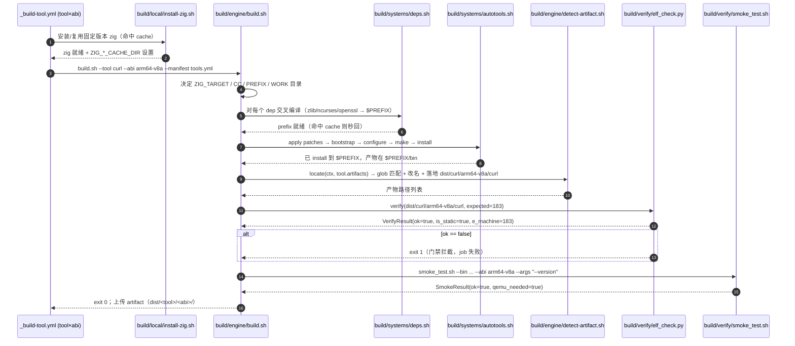
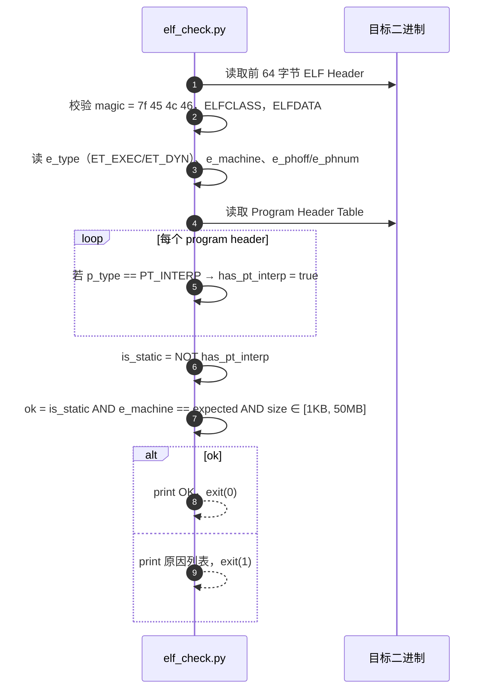
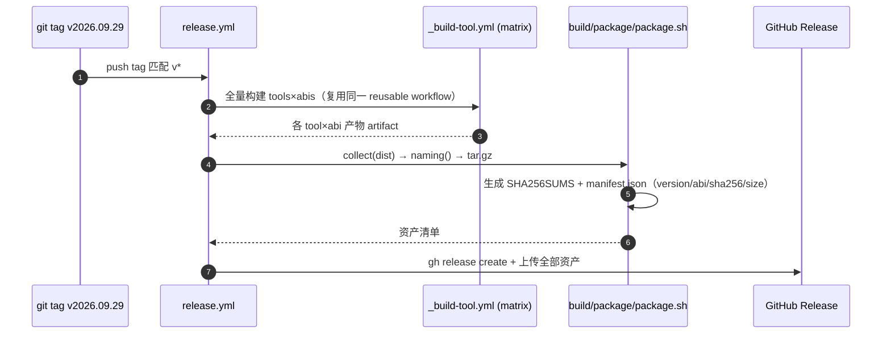
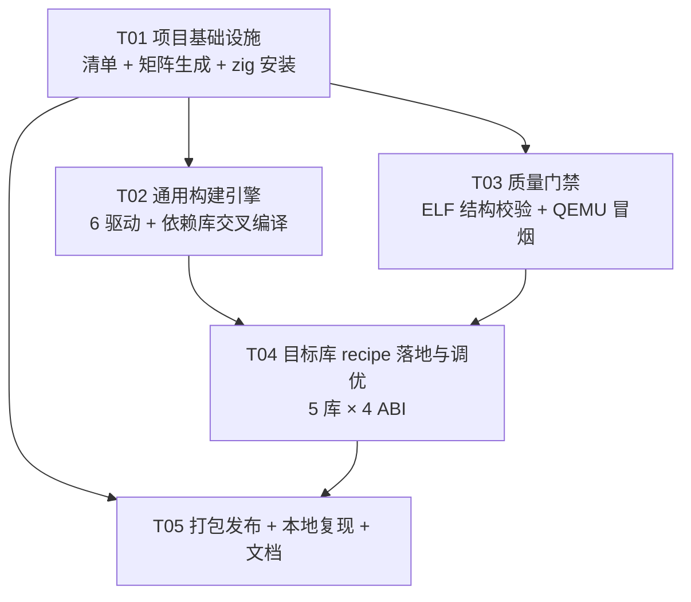

# adb-bin-box 系统设计文档

> Android 命令行工具静态二进制构建工厂 —— 用 GitHub Actions + Zig 内置 musl 交叉编译，为 4 个 ABI 产出可直接 `adb push` 运行的单文件静态二进制。
>
> 作者：架构师 Bob（高见远）｜版本：v1.0｜日期：2026-09-29

---

## 0. 前提与既定事实（来自主理人亲测，本设计直接采信）

| # | 事实 | 对本设计的约束 |
|---|---|---|
| F1 | NDK `-static` 不可用于网络工具（bionic 把网络/DNS 委托给 netd，libc 与设备 netd 协议需版本匹配） | **放弃 NDK 主力路线** |
| F2 | musl.cc 在 GitHub Actions 被全站封禁 | **任何方案禁止从 musl.cc 站内下载工具链** |
| F3 | `zig cc -target <triple>` 自带 musl libc + compiler-rt，本机实测通过 | **主力方案 = Zig 内置 musl 交叉编译** |
| F4 | 静态 musl 二进制不链接设备 bionic，天然跨 Android 版本（4.4~15 只需 syscall 兼容） | **"全版本兼容"由 4 个 ABI × 静态链接保证，而非 minSdk 矩阵** |
| F5 | 运行时限制：DNS 无 `/etc/resolv.conf`、strace 依赖 ptrace 需 root、htop 读 /proc 需 root 才能全字段、stress-ng 部分 stressor 需 root、Android 10+ seccomp | **README 必须正面披露；部署到 `/data/local/tmp`** |
| F6 | 5 个目标库最新版本已核实（见下表） | **清单默认锁定这些版本** |

目标库版本（2026-09-29 核实）：

| 库 | 版本 | 上游 repo | 构建系统 |
|---|---|---|---|
| stress-ng | 0.22.01 | ColinIanKing/stress-ng | Makefile |
| htop | 3.5.3 | htop-dev/htop | autotools |
| curl | 8.22.0 | curl/curl | autotools |
| iperf | 3.21 | esnet/iperf | autotools |
| strace | 7.2 | strace/strace | autotools |

ABI ↔ Zig target 映射（**全局唯一真源**，见 `build/verify/abi_matrix.json`）：

| Android ABI | Zig target | `e_machine` | 位宽 | 冒烟 QEMU |
|---|---|---|---|---|
| `arm64-v8a` | `aarch64-linux-musl` | 183 (EM_AARCH64) | 64 | `qemu-aarch64-static` |
| `armeabi-v7a` | `arm-linux-musleabihf` | 40 (EM_ARM) | 32 | `qemu-arm-static` |
| `x86_64` | `x86_64-linux-musl` | 62 (EM_X86_64) | 64 | 原生执行 |
| `x86` | `x86-linux-musl` | 3 (EM_386) | 32 | 原生执行（IA32 兼容内核） |

---

# Part A：系统设计

## 1. 实现方案

### 1.1 核心难点分析

| 难点 | 应对策略 |
|---|---|
| **交叉工具链来源**（F2 断了 musl.cc） | 用 `zig cc -target`，零外部工具链下载；zig 单二进制自带 musl + libc 头 + compiler-rt + ld |
| **"全版本 Android"（需求 2）** | 不追 minSdk 矩阵，靠 **4 个 ABI × 静态链接** 覆盖（F4）。API 等级对静态 musl 无意义 |
| **"单文件静态产物"（需求 5）** | 强制 `-static`；用**结构性**判据（无 `PT_INTERP` 段）做硬门禁，拒绝"看起来静态" |
| **用户低门槛加库（需求 3）** | **声明式清单 `tools.yml` 驱动一切**：加库 = 加一段 YAML，不改 workflow、不改引擎 |
| **第三方依赖库**（curl 需 openssl/zlib、htop 需 ncurses） | 三级取舍策略（见 1.4）：先砍可选依赖保底跑通，再静态连锁编译必要库 |
| **Zig 首次编译 libc 慢（F3）** | `actions/cache` 缓存 `ZIG_GLOBAL_CACHE_DIR` + 依赖 prefix，按 (zig 版本, target) 分键 |
| **从"编译过"到"真的能跑"** | QEMU user-static 冒烟测试（见 3.2） |

### 1.2 框架 / 技术选型

| 组件 | 选型 | 理由 |
|---|---|---|
| 交叉工具链 | **Zig**（固定版本，如 `0.16.0`） | 单文件自带 musl/compiler-rt/ld，`zig cc` 即完整 cross-cc，符合 F3/F2 |
| libc | **musl**（zig 内置） | 静态无 glibc 的 NSS/dlopen 问题；不依赖设备 bionic |
| 构建驱动 | **Shell**（POSIX sh + bash） | 需编排 autotools/cmake/make/meson/go；shell 最贴近原生命令 |
| 清单解析 / 矩阵生成 / ELF 校验 | **Python 3 + PyYAML（纯标准库为主）** | 容器里可能无 `readelf`/`file`，Python 直接解析 ELF 结构，零 binutils 依赖 |
| CI | **GitHub Actions**（Ubuntu runner） | 需求指定；支持 job matrix、reusable workflow、cache |
| 冒烟执行 | **qemu-user-static + binfmt**（`docker/setup-qemu-action`） | 在 x86_64 runner 上真跑 aarch64/arm 产物 |
| 打包 | **tar.gz + sha256sum + gh cli** | 释放资产命名一眼可辨 |

### 1.3 架构模式：**声明式清单 + 通用构建引擎 + 每库薄配置（Data-Driven Pipeline）**

```
tools.yml / deps.yml  ──►  generate_matrix.py  ──►  strategy.matrix（动态）
        │                                                  │
        └──►  manifest.py（校验/默认值/依赖解析）           ▼
                     │                          _build-tool.yml（reusable, 每 tool×abi）
                     ▼                                    │
              build/engine/build.sh  ◄────────────────────┘
                     │  选择 build system driver
                     ├─ systems/autotools.sh / cmake.sh / make.sh / meson.sh / go.sh / script.sh
                     ├─ systems/deps.sh（先静态交叉编译依赖库 → $PREFIX）
                     ├─ engine/detect-artifact.sh（按规则定位产物）
                     ├─ verify/elf_check.py（硬门禁：静态性 + 架构）
                     └─ verify/smoke_test.sh（QEMU 真跑）
```

**关键决策：通用引擎 + 每库一份薄配置（而非每库一个完整脚本）**
- 5 个目标库中 4 个是 autotools，差异只是 configure flags / deps，用**同一份 `autotools.sh`** 即可覆盖。
- 加库成本 = 往 `tools.yml` 加一段 YAML（多数情况零脚本），直接满足需求 3"低门槛扩充"。
- 只有遇到需要打补丁/特殊 bootstrap 的库，才落一个 `patches/<tool>.patch` 或 `build/hooks/<tool>.sh`。
- **对比"每库一个脚本"**：会产生大量重复的 zig 环境设置/缓存/校验代码，维护成本高且易漂移，故不采用。

### 1.4 ⭐ 依赖库取舍策略（本设计最难的点，明确三级优先级）

**核心原则：能用 zig 内置 libc 解决就不引第三方；必须引的，只引"交叉友好"的静态库；能砍的可选依赖一律先砍。**

| 级别 | 策略 | 手段 | 适用 |
|---|---|---|---|
| **Tier 0 · 零依赖** | 只依赖 zig 内置 musl libc | 无需处理依赖 | strace、iperf3 |
| **Tier 1 · 砍可选依赖** | 用 `--without-*` / `--disable-*` 关闭一切可选外部库 | configure flags | curl（`--without-ssl --without-zlib ...`）、stress-ng（无 zlib 也能编） |
| **Tier 2 · 静态连锁编译** | 把必要依赖也编成静态 `.a`，装进 `$PREFIX`，再编主程序 | `deps.sh` + `CPPFLAGS=-I$PREFIX/include` `LDFLAGS="-static -L$PREFIX/lib"` | **htop→ncurses（强制）**、curl→openssl/zlib（增强） |

**每个目标库的具体建议：**

| 库 | Tier | 依赖决策 | 说明 |
|---|---|---|---|
| **strace** | 0 | 无 | `--enable-static --without-libunwind --without-libdw --enable-stacktrace=no --enable-mpers=no`。⚠️ 风险：musl 下 syscall 表可能需补丁，列入待验证 |
| **iperf** | 0 | 无 | `--enable-static --without-openssl`（3.x 的加密可选）。源码 tarball 若无 `configure` → 引擎自动 `autoreconf -fi` |
| **stress-ng** | 1 | 无（zlib 可选） | 纯 Makefile。默认关 zlib/b存；`--with-zlib` 作为增强项后面再加 |
| **htop** | 2 | **ncurses（强制）** | 无 ncurses 不能编译。用宽字符版 `ncursesw` 静态库。其余 `--disable-hwloc/capabilities/sensors/delayacct/affinity` 全砍 |
| **curl** | 1 → 2 | 无（先）→ openssl + zlib（增强） | **Phase 1 保底**：`--without-ssl --without-zlib --without-brotli --without-zstd --without-libidn2 --without-libpsl --without-nghttp2` + 关 tftp/ldap/rtsp/dict/telnet/pop3/imap/smtp/gopher/mqtt。**Phase 2 增强**：`features: [tls]` → 静态编 openssl |

**取舍结论**：
1. **Phase 1（P0）先把 5 个库全部跑通**，curl 用 `--without-ssl`（HTTPS 暂时不可用，但 HTTP/DNS/传输全通，且证明整条流水线成立）。
2. **Phase 2（P1）再增强 curl**：静态编 openssl（`no-shared no-tests no-legacy`，用 `linux-aarch64/linux-armv4/linux-x86_64/linux-elf` 作为 per-ABI 目标）。openssl 是重依赖，单独隔离，失败不阻塞 Phase 1。
3. zlib 简单、无 autotools 陷阱，可做为**验证 deps 机制的第一块试金石**（stress-ng / curl 都能挂）。

---

## 2. 文件列表（完整相对路径）

```
adb-bin-box/
├── README.md                                  # 使用 / 限制 / 如何加库（T05 补全）
├── .gitignore                                 # dist/, .zig-cache/, work/ 等
├── tools.yml                                  # ★ 工具清单（唯一真源，用户加库改这里）
├── deps.yml                                   # ★ 依赖库清单（ncurses/zlib/openssl）
├── VERSION                                     # 全局发布版本（供 release 命名）
│
├── .github/
│   └── workflows/
│       ├── build.yml                          # 主构建：generate → build(matrix) → verify → package
│       ├── _build-tool.yml                    # 可复用 workflow（workflow_call）：构建单个 tool×abi
│       ├── release.yml                        # 打 tag 触发：全量构建 + 生成 Release 资产
│       └── lint.yml                           # shellcheck / yamllint / actionlint（质量）
│
├── build/
│   ├── gen/
│   │   ├── schema.json                        # tools.yml / deps.yml 的 JSON Schema
│   │   ├── manifest.py                        # 清单加载 / 校验 / 默认值展开 / 依赖解析
│   │   └── generate_matrix.py                 # 清单 → strategy.matrix JSON（含分片）
│   │
│   ├── engine/
│   │   ├── build.sh                           # ★ 通用构建引擎入口
│   │   ├── common.sh                          # 公共函数：日志/变量/zig 环境/交叉变量
│   │   └── detect-artifact.sh                 # 按 ArtifactRule 定位产物 + 改名 + 落地 out/
│   │
│   ├── systems/                               # 构建系统驱动（每个 build_system 一个）
│   │   ├── autotools.sh
│   │   ├── cmake.sh
│   │   ├── cmake-toolchain.cmake.in           # 交叉工具链模板（每 ABI 生成）
│   │   ├── make.sh
│   │   ├── meson.sh
│   │   ├── go.sh
│   │   ├── script.sh                          # 自定义命令（含 openssl ./Configure）
│   │   └── deps.sh                            # 依赖库静态交叉编译（先于主库执行）
│   │
│   ├── verify/
│   │   ├── abi_matrix.json                    # ABI ↔ zig target ↔ e_machine ↔ qemu 映射
│   │   ├── elf_check.py                       # ★ ELF 结构校验器（硬门禁）
│   │   └── smoke_test.sh                      # QEMU/binfmt 冒烟执行
│   │
│   ├── package/
│   │   ├── package.sh                         # 收集产物 + 命名 + 打包 tar.gz
│   │   └── naming.sh                          # 命名规范（唯一实现，被多处引用）
│   │
│   └── local/
│       ├── build_local.sh                     # 本地复现构建（不依赖 CI）
│       └── install-zig.sh                     # 本地/CI 安装固定版本 zig（含缓存目录设置）
│
├── patches/                                   # 每库补丁（按需）
│   └── .gitkeep
│
├── docs/
│   ├── system_design.md                       # 本文件
│   ├── sequence-diagram.mermaid
│   └── class-diagram.mermaid
│
└── dist/                                      # 产物输出（gitignore；CI 上传为 artifact）
    └── <tool>/<abi>/<tool>
```

**目录职责边界**：
- `build/gen/*`：只做"读清单、产矩阵/校验"，**永不编译**。
- `build/engine/* + build/systems/*`：只做"编译"，**不读 yml 之外的知识**。
- `build/verify/*`：只做"判定对错"，无副作用。
- `build/package/*`：只做"收集与命名"。

---

## 3. 数据结构与接口

### 3.1 类图（classDiagram）



### 3.2 `tools.yml` 完整字段定义（schema v1）

顶层：

| 字段 | 类型 | 必填 | 说明 |
|---|---|---|---|
| `version` | int | ✅ | schema 版本，当前 `1` |
| `defaults.abis` | string[] | ➖ | 默认 `[arm64-v8a, armeabi-v7a, x86_64, x86]` |
| `defaults.cflags` | string | ➖ | 默认 `-O2 -fPIC` |
| `defaults.ldflags` | string | ➖ | 默认 `-static` |
| `defaults.strip` | bool | ➖ | 默认 `false`（zig 无独立 strip，交由 `llvm-strip` 可选） |
| `tools[]` | ToolSpec[] | ✅ | 工具列表 |

`ToolSpec` 字段：

| 字段 | 类型 | 必填 | 说明 |
|---|---|---|---|
| `id` | string | ✅ | 唯一 slug（小写、`-`），同时是默认 `bin` 名、产物目录名、矩阵 key |
| `name` | string | ➖ | 展示名，默认 = `id` |
| `version` | string | ✅ | 上游版本（用于拼 source URL、产物命名、冒烟断言） |
| `repo` | string | ➖ | `owner/name`，用于 GitHub release 下载与来源记录 |
| `source.type` | enum | ➖ | `tarball`(默认) / `git` / `local` |
| `source.url` | string | ✅ | 支持 `{version}` `{tag}` 模板；`strip_components` 默认 1 |
| `source.tag` | string | ➖ | `type=git` 时的 ref，支持 `{version}` 模板 |
| `build_system` | enum | ✅ | `autotools` / `cmake` / `make` / `meson` / `go` / `script` |
| `deps` | string[] | ➖ | 引用 `deps.yml` 的 dep id（Tier 2） |
| `features` | string[] | ➖ | 能力开关（如 `[tls, zlib]`），驱动 flags 追加，缺省关闭 |
| `abis` | string[] | ➖ | 覆盖默认 ABI 集 |
| `bin` | string | ➖ | 最终二进制名，默认 = `id` |
| `tier` | int | ➖ | 0/1/2，仅记录取舍级别（文档/排序用） |
| `enabled` | bool | ➖ | 默认 `true`；`false` 则不进矩阵 |
| `env` | map | ➖ | 追加构建环境变量 |
| `configure.flags` | string[] | ➖ | 传给 configure/cmake 的 flags |
| `configure.command` | string | ➖ | `build_system=script` 时的完整配置命令 |
| `configure.bootstrap` | string[] | ➖ | 如 `[autoreconf -fi]`（无 configure 时） |
| `make.targets` | string[] | ➖ | 默认 `[all]` |
| `make.install_target` | string | ➖ | 默认 `install` |
| `hooks.pre_configure/post_configure/pre_build/post_build/post_install` | string[] | ➖ | 内联 shell 命令或脚本路径 |
| `patches` | string[] | ➖ | 相对 `patches/` 的补丁文件 |
| `artifacts[]` | ArtifactRule[] | ➖ | 产物定位规则；缺省则取 `install` 到 `$PREFIX/bin/<bin>` |
| `artifacts[].path` | string(glob) | ✅(规则内) | 相对 `$PREFIX` 或 `ctx.build_dir` |
| `artifacts[].bin_name` | string | ➖ | 落地改名 |
| `artifacts[].strip` | bool | ➖ | 默认跟随 defaults |
| `artifacts[].required` | bool | ➖ | 默认 `true`；`false` 则缺失只告警 |
| `smoke.args` | string[] | ➖ | 默认 `[--version]` |
| `smoke.expect_exit` | int | ➖ | 默认 `0` |
| `smoke.contains` | string | ➖ | 期望 stdout 含子串 |
| `abi_overrides.<abi>.*` | map | ➖ | 针对某 ABI 覆盖上述任意字段（深合并） |
| `notes` | string | ➖ | 备注（写进产物 README.txt） |

### 3.3 `deps.yml` 完整字段定义

顶层：`version: 1` + `deps[]`。

| 字段 | 类型 | 必填 | 说明 |
|---|---|---|---|
| `id` | string | ✅ | 依赖唯一名（如 `ncurses`） |
| `version` | string | ✅ | 上游版本 |
| `repo` | string | ➖ | `owner/name` |
| `source.{type,url,tag,strip_components}` | – | ✅ | 同 ToolSpec.source |
| `build_system` | enum | ✅ | 同 ToolSpec |
| `configure.flags/command/bootstrap` | – | ➖ | 同 ToolSpec |
| `static` | bool | ➖ | 默认 `true`（本项目恒为静态） |
| `provides` | string[] | ➖ | 该库提供的 pkg-config 名（用于文档/断言） |
| `abi_overrides` | map | ➖ | 同 ToolSpec |
| `notes` | string | ➖ | 备注 |

### 3.4 真实填充示例

**示例 A：`tools.yml` 中 curl（Phase 1 保底 + Phase 2 增强注释）**

```yaml
version: 1
defaults:
  abis: [arm64-v8a, armeabi-v7a, x86_64, x86]
  cflags: "-O2 -fPIC"
  ldflags: "-static"
tools:
  - id: curl
    name: curl
    version: "8.22.0"
    repo: curl/curl
    source:
      type: tarball
      url: "https://curl.se/download/curl-{version}.tar.gz"
      strip_components: 1
    build_system: autotools
    tier: 1
    bin: curl
    deps: []                 # Phase 2: [openssl, zlib]
    features: []             # Phase 2: [tls, zlib]
    configure:
      flags:
        - "--disable-shared"
        - "--enable-static"
        - "--without-ssl"
        - "--without-zlib"
        - "--without-brotli"
        - "--without-zstd"
        - "--without-libidn2"
        - "--without-libpsl"
        - "--without-nghttp2"
        - "--disable-ldap"
        - "--disable-rtsp"
        - "--disable-dict"
        - "--disable-telnet"
        - "--disable-tftp"
        - "--disable-pop3"
        - "--disable-imap"
        - "--disable-smtp"
        - "--disable-gopher"
        - "--disable-mqtt"
        - "--disable-manual"
    smoke:
      args: ["--version"]
      contains: "curl 8.22.0"
    notes: "Phase1 无 TLS；Phase2 打开 features:[tls] 静态编 openssl 后支持 https"
```

**示例 B：`tools.yml` 中 htop（Tier 2，强制 ncurses）**

```yaml
  - id: htop
    name: htop
    version: "3.5.3"
    repo: htop-dev/htop
    source:
      type: tarball
      url: "https://github.com/htop-dev/htop/releases/download/{version}/htop-{version}.tar.xz"
      strip_components: 1
    build_system: autotools
    tier: 2
    bin: htop
    deps: [ncurses]
    configure:
      flags:
        - "--disable-shared"
        - "--enable-static"
        - "--disable-hwloc"
        - "--disable-affinity"
        - "--disable-capabilities"
        - "--disable-sensors"
        - "--disable-delayacct"
    smoke:
      args: ["--version"]
      contains: "3.5.3"
    notes: "需宽字符 ncursesw 静态库；非 root 下部分 /proc 字段不可见（见 README 限制）"
```

**示例 C：`deps.yml` 中 ncurses + zlib**

```yaml
version: 1
deps:
  - id: ncurses
    version: "6.5"
    repo: mirror/ncurses
    source:
      type: tarball
      url: "https://invisible-mirror.net/archives/ncurses/ncurses-{version}.tar.gz"
      strip_components: 1
    build_system: autotools
    static: true
    provides: [ncursesw, ncurses]
    configure:
      flags:
        - "--enable-static"
        - "--disable-shared"
        - "--enable-widec"
        - "--without-shared"
        - "--without-debug"
        - "--without-ada"
        - "--without-manpages"
        - "--without-tests"
        - "--without-progs"
        - "--disable-stripping"
  - id: zlib
    version: "1.3.1"
    repo: madler/zlib
    source:
      type: tarball
      url: "https://zlib.net/fossils/zlib-{version}.tar.gz"
      strip_components: 1
    build_system: make
    static: true
    provides: [zlib]
```

### 3.5 ABI 映射真源 `build/verify/abi_matrix.json`

```json
{
  "arm64-v8a":   { "zig_target": "aarch64-linux-musl",   "e_machine": 183, "bits": 64, "qemu": "qemu-aarch64-static", "runner": "ubuntu-24.04" },
  "armeabi-v7a": { "zig_target": "arm-linux-musleabihf", "e_machine": 40,  "bits": 32, "qemu": "qemu-arm-static",     "runner": "ubuntu-24.04" },
  "x86_64":      { "zig_target": "x86_64-linux-musl",    "e_machine": 62,  "bits": 64, "qemu": null,                  "runner": "ubuntu-24.04" },
  "x86":         { "zig_target": "x86-linux-musl",       "e_machine": 3,   "bits": 32, "qemu": null,                  "runner": "ubuntu-24.04" }
}
```

### 3.6 引擎关键环境变量契约（`common.sh` 设置，driver 消费）

```sh
ZIG_VERSION="${ZIG_VERSION:-0.16.0}"                  # 唯一钉版处
ZIG_GLOBAL_CACHE_DIR="$WORK/.zig-global"              # F3：zig 需要可写缓存
ZIG_LOCAL_CACHE_DIR="$WORK/.zig-local"                # F3：否则 AccessDenied
ZIG_TARGET="aarch64-linux-musl"                       # 由 abi 决定
export CC="zig cc -target $ZIG_TARGET"
export CXX="zig c++ -target $ZIG_TARGET"
export AR="zig ar"  RANLIB="zig ranlib"
export STRIP="$(command -v llvm-strip || echo true)"  # zig 无独立 strip；无则 noop
export CFLAGS="-O2 -fPIC"  CXXFLAGS="$CFLAGS"
export LDFLAGS="-static -L$PREFIX/lib"
export CPPFLAGS="-I$PREFIX/include"
export PKG_CONFIG_PATH="$PREFIX/lib/pkgconfig:$PREFIX/share/pkgconfig"
export PKG_CONFIG="pkg-config --static"
export CONFIG_SITE="$BUILD_DIR/config.site"           # autotools 加速/规避缓存变量
```

---

## 4. 程序调用流程（sequenceDiagram）

### 4.1 清单 → 动态矩阵（每次 push / PR / 手动）



### 4.2 单个 tool × abi 完整构建（可复用 workflow 内）



### 4.3 ELF 硬门禁校验（无 binutils 的结构性判定）



### 4.4 发布（打 tag → Release 资产）



---

## 5. 不明确项 / 假设（Anything UNCLEAR）

| # | 事项 | 当前假设 | 需要谁拍板 |
|---|---|---|---|
| U1 | **默认 ABI 集合** | 默认 4 个全出（含已很罕见的 `x86`、`armeabi-v7a`，CI 分钟数×2） | 用户 |
| U2 | **curl 是否静态编 openssl** | Phase 1 先 `--without-ssl`（无 HTTPS），Phase 2 再加 | 用户（需求 4"先跑通"倾向先保底） |
| U3 | **是否要 root 工具** | 只出普通工具；strace/htop 全字段需 root，README 说明 | 用户 |
| U4 | **Zig 版本钉版** | 默认 `0.16.0`（主理人本机实测版本），但需确认存在可下载的官方 release 包 | 主理人/Eng |
| U5 | **iperf 源 tarball 是否含 configure** | 假设可能不含 → 引擎自动 `autoreconf -fi` | Eng 实测 |
| U6 | **strace 在 musl 静态下能否编过** | 有风险（syscall 表/`--enable-mpers`），列为首个待验证项 | Eng 实测 |
| U7 | **发布触发方式** | 假设打 `v*` tag 触发；是否也需"每次 push 出 nightly 预发布"未定 | 用户 |
| U8 | **strip 策略** | 默认不 strip（保留 zig/llvm 可用 strip）；体积 ~1.6MB/文件可接受 | 用户 |
| U9 | **许可证合规** | htop/strace/stress-ng 为 GPL，二进制分发需附对应源码/许可证；本设计预留 `LICENSES/` + `SOURCE.txt` 位置 | 用户（法律/合规） |
| U10 | **是否需 `adb push` 一键脚本** | 建议随 Release 附带 `install-to-device.sh`，未纳入 Phase 1 | 用户 |

---

# Part B：任务分解

## 6. 依赖包（Required Packages）

> ⚠️ 本项目是 **CI/CD 构建系统 + Shell/Python/YAML 工程**，无前端/数据库依赖。

**运行时工具链（构建必需）：**

```
- zig@0.16.0                      # 唯一交叉工具链；单文件自带 musl/compiler-rt/ld（F3）
- python3@>=3.10                  # 清单解析 / 矩阵生成 / ELF 校验（主要用标准库）
- pyyaml@^6.0                    # 解析 tools.yml / deps.yml（唯一第三方 Python 包）
- tar / xz / gzip                # 解压上游源码 tarball
- make / automake / autoconf / libtool  # autotools 驱动所需（宿主工具，runner 自带）
- autoreconf                      # iperf 等无 configure 时自动生成（见 U5）
- qemu-user-static               # 冒烟执行 arm/arm64 产物（F4 之外的真跑验证）
- coreutils (sha256sum)          # 产物校验和
```

**GitHub Actions（workflow 引用）：**

```
- actions/checkout@v4
- actions/cache@v4               # 缓存 zig global cache + 依赖 prefix
- actions/upload-artifact@v4
- actions/download-artifact@v4
- docker/setup-qemu-action@v3    # binfmt：在 x86_64 runner 跑 arm/arm64
- softprops/action-gh-release@v2 # 或 gh cli 发布 Release
- ludeeus/action-shellcheck@master  # lint（可选）
```

**开发期 lint（lint.yml，可选）：**

```
- shellcheck                      # *.sh
- yamllint                        # *.yml
- actionlint                      # .github/workflows/*.yml
- python3 -m json.tool            # schema.json / abi_matrix.json 语法
```

---

## 7. 任务列表（≤5 个，按依赖排序）

### T01 · 项目基础设施 + 声明式清单 + 矩阵生成
- **Task ID**: T01 ｜ **优先级**: P0
- **目标**：搭好仓库骨架、定义清单 schema、打通"清单 → 动态矩阵"这条主动脉（此步只生成矩阵，构建步骤可为 stub）。
- **Source Files**:
  - `README.md`（骨架：项目简介 + 加库三步 + 待补章节占位）
  - `.gitignore`
  - `tools.yml`（含 5 个目标库完整条目）
  - `deps.yml`（ncurses / zlib，openssl 占位注释）
  - `build/gen/schema.json`
  - `build/gen/manifest.py`
  - `build/gen/generate_matrix.py`
  - `build/verify/abi_matrix.json`
  - `.github/workflows/build.yml`（generate job 生效，build job 先 stub）
  - `.github/workflows/lint.yml`
  - `build/local/install-zig.sh`
- **Dependencies**: 无
- **验收**：本地 `python build/gen/generate_matrix.py tools.yml` 输出合法 `{"include":[...]}`，长度 = 5×4=20；workflow 的 `generate` job 成功且 `build` job 正确展开 20 个 job。

### T02 · 通用构建引擎 + 交叉编译依赖库
- **Task ID**: T02 ｜ **优先级**: P0
- **目标**：实现 `build.sh` 引擎、6 个 build system 驱动、依赖库静态交叉编译（先以 zlib/ncurses 打通 Tier 2）。
- **Source Files**:
  - `build/engine/build.sh`
  - `build/engine/common.sh`
  - `build/engine/detect-artifact.sh`
  - `build/systems/autotools.sh`
  - `build/systems/make.sh`
  - `build/systems/cmake.sh` + `build/systems/cmake-toolchain.cmake.in`
  - `build/systems/meson.sh`
  - `build/systems/go.sh`
  - `build/systems/script.sh`
  - `build/systems/deps.sh`
- **Dependencies**: T01
- **验收**：`build/local/build_local.sh --tool htop --abi arm64-v8a` 能在本地产出 `dist/htop/arm64-v8a/htop`（含 ncurses 静态依赖）；`deps.sh` 缓存命中。

### T03 · 质量门禁：ELF 结构校验 + QEMU 冒烟测试
- **Task ID**: T03 ｜ **优先级**: P0
- **目标**：把主理人的 ELF 校验原型纳入为**每构建硬门禁**，并增加 QEMU 冒烟，把"编译过"升级为"真的能跑"。
- **Source Files**:
  - `build/verify/elf_check.py`（原型产品化：CLI 参数化 + 退出码 + 原因输出）
  - `build/verify/smoke_test.sh`（binfmt/qemu 调度 + 断言 exit/contains）
  - `build/verify/README.md`（校验项清单说明）
  - 接入改动：`.github/workflows/build.yml`（在 `_build-tool` 中调用校验与冒烟）
- **Dependencies**: T01（校验器独立，可先于 T02；接入 workflow 需 T01）
- **验收**：对 T02 产物，4 个 ABI 全部通过 `elf_check.py`（is_static && e_machine 匹配）；`x86_64/x86` 原生跑通 `--version`，`arm64-v8a/armeabi-v7a` 经 qemu 跑通；人为植入动态二进制能被正确拒绝。

### T04 · 目标库 recipe 落地与调优
- **Task ID**: T04 ｜ **优先级**: P0
- **目标**：把 5 个库全部编成静态二进制并全绿（Phase 1）；补齐必要 patches/hooks；锁定 Tier 决策。
- **Source Files**:
  - `tools.yml`（5 库 flags 调优：curl/htop/iperf/strace/stress-ng）
  - `deps.yml`（必要时补充依赖）
  - `patches/*.patch`（如 strace/musl、iperf bootstrap 所需）
  - `build/hooks/*.sh`（个别库的 pre/post 钩子，如 iperf `autoreconf -fi`、openssl `./Configure`）
- **Dependencies**: T02, T03
- **验收**：5 库 × 4 ABI = 20 个 job 全绿；每个产物过 ELF 门禁 + QEMU 冒烟；curl HTTP、iperf3、strace、htop、stress-ng `--version` 均正确输出。

### T05 · 产物打包/发布 + 本地复现 + 文档补全
- **Task ID**: T05 ｜ **优先级**: P1
- **目标**：产物命名、打包 tar.gz、SHA256SUMS、manifest.json；tag 触发 Release；本地一键复现；README 补全（用法/限制/加库）。
- **Source Files**:
  - `build/package/package.sh`
  - `build/package/naming.sh`
  - `.github/workflows/release.yml`
  - `build/local/build_local.sh`
  - `README.md`（完整版：安装到设备、运行时限制 F5、加库三步、各工具说明、许可证）
  - `VERSION`
- **Dependencies**: T01, T04
- **验收**：`git push tag v*` 后 GitHub Release 出现全部资产；资产命名一眼可辨（见 §8 命名规范）；README 三节齐全且示例可复制执行。

---

## 8. 共享知识（Shared Knowledge）

**产物命名规范（唯一实现：`build/package/naming.sh`，多处引用）**

```
单二进制:  <tool>-<version>-android-<abi>            例: curl-8.22.0-android-arm64-v8a
压缩包:    <tool>-<version>-android-<abi>.tar.gz     （内含 <bin> + README.txt + LICENSE* + SHA256）
全量包:    adb-bin-box-<VERSION>-all.tar.gz          （VERSION 文件内容，如 2026.09.29）
校验:      SHA256SUMS（全局）+ manifest.json（{tool,version,abi,sha256,size}）
```

**统一约定**

- 所有路径相对仓库根；构建工作目录用 `$RUNNER_TEMP/work`（`src/ build/ prefix/ out/`）。
- 全局 ABI 真源 = `build/verify/abi_matrix.json`；**任何地方不得再硬编码 zig triple**，一律从此读取。
- 全局 zig 版本真源 = 环境变量 `ZIG_VERSION`（默认 `0.16.0`），CI 与本地共用 `install-zig.sh`。
- 引擎环境契约见 §3.6，driver 只消费不重定义。
- 校验是**硬门禁**：`elf_check.py` 失败 → job 直接 fail；禁止降级为 warning。
- 冒烟断言失败 → 同样 fail（但可对个别工具用 `smoke.expect_exit` 放宽）。
- 日志：所有脚本输出带 `[tool/abi]` 前缀，便于矩阵定位。
- 退出码语义：0=成功；1=构建失败；2=校验失败；3=冒烟失败。

---

## 9. 任务依赖图



**说明**：本项目的线性依赖链较短（最深 3 跳），且每个任务都产出可运行增量——T01 结束即可看到 20-job 矩阵；T02 结束可本地产出一个真二进制；T03 结束有真跑证据；T04 是产品本体；T05 是交付面。T03 与 T02 之间无强依赖（校验器可独立开发），故二者可并行。

---

## 附：主理人问题清单的逐条回答（自查）

- **A1 矩阵如何生成**：`tools.yml` → `generate_matrix.py` → `generate` job 写 `$GITHUB_OUTPUT` 的 `matrix` → `strategy.matrix: ${{ fromJSON(needs.generate.outputs.matrix) }}`；用 `include` 数组规避 matrix 维度上限；256 job 上限通过"每片 ≤256 自动分片"处理（4 ABI 下可支持 64 库/片）。
- **A2 schema**：见 §3.2/§3.3 完整字段表 + §3.4 三个真实示例。
- **A3 依赖何解**：见 §1.4 三级策略；结论 = Phase1 砍依赖保底，Phase2 只静态编"交叉友好"的 ncurses/zlib/openssl。
- **B 目录结构**：见 §2（workflow 已拆 build/_build-tool/release/lint；recipe = 通用引擎 + 每库薄 YAML）。
- **C1 校验项**：静态性（无 PT_INTERP）、`e_machine`、`e_type`、可执行位、体积区间、可选冒烟。
- **C2 冒烟/QEMU**：可行；x86_64/x86 原生跑，arm/arm64 用 `docker/setup-qemu-action` + binfmt + `qemu-*-static`。
- **C3 CI 时长**：20 job 并行、`fail-fast:false`、zig 与 prefix 双层 cache、`timeout-minutes:30`、concurrency 取消旧跑。
- **D 任务分解**：见 §7（5 个任务，T01 为基础设施）。
- **E 待拍板**：见 §5（U1~U10）。
